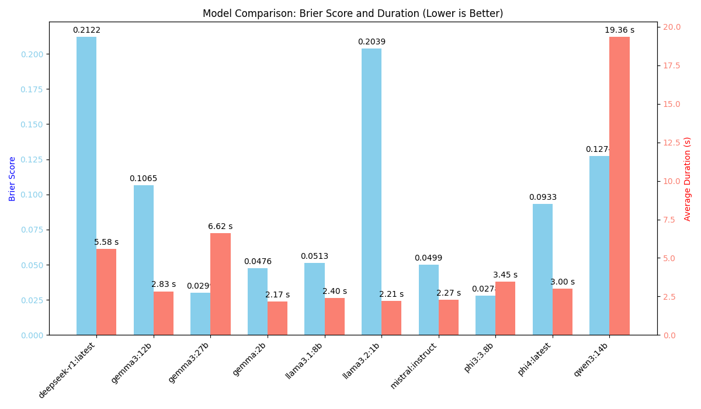
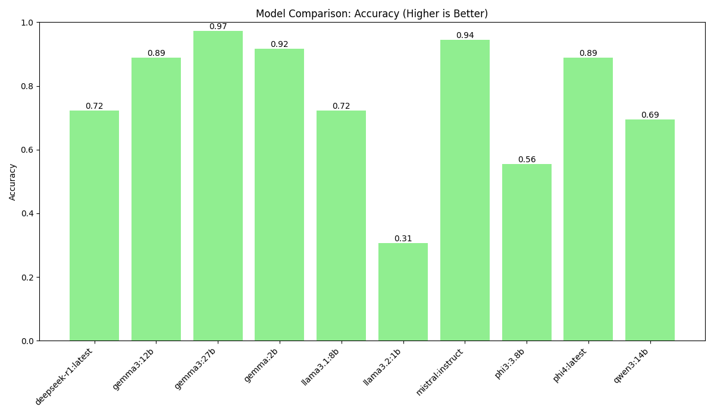

# LLM Intent Classification Benchmark

This repository provides a Python-based benchmark to evaluate the intent classification performance of Large Language Models (LLMs) served via Ollama. It systematically tests models for their ability to correctly classify user queries into predefined categories, measuring performance with metrics that balance accuracy and confidence.

The benchmark uses the **Brier Score** as its primary evaluation metric, which provides a more nuanced measure of performance than simple accuracy. A lower Brier score indicates better calibration and is preferred.

## Key Features

- **Automated Workflow**: Automatically detects and tests all available Ollama models.
- **Robust Testing**: Uses a diverse suite of test queries, including ambiguous ones, to challenge the models.
- **Advanced Analytics**:
    - **Brier Score**: Measures both accuracy and confidence calibration.
    - **Accuracy**: Calculates the percentage of correct classifications.
    - **Performance Timing**: Tracks the average response time for each model.
- **Modular Design**:
    - `run_tests.py`: Runs the benchmark and collects performance data.
    - `analyze_results.py`: Processes the data to generate a detailed analysis.
- **Multi-Format Reports**: Generates an analysis directory with:
    - A `summary.json` file with detailed metrics.
    - A `summary.txt` file with a clean, human-readable ASCII table.
    - PNG plots for visual comparison of models (`accuracy_comparison.png`, `brier_duration_comparison.png`).

---

## Prerequisites

- **Python 3.8+**
- **Ollama**: Must be installed and running. See the official [Ollama documentation](https://github.com/ollama/ollama).
- **Python Libraries**: `requests`, `numpy`, `matplotlib`, `tabulate`.

---

## Installation

1.  **Clone the repository:**
    ```bash
    git clone https://github.com/AITrekker/llm-intent-benchmark.git
    cd llm-intent-benchmark
    ```

2.  **Install the required Python libraries:**
    ```bash
    pip install -r requirements.txt
    ```

---

## How to Run the Benchmark

1.  **Start the Ollama server** in a separate terminal:
    ```bash
    ollama serve
    ```
    The benchmark script expects the server to be running at `http://localhost:11434`.

2.  **Run the benchmark script:**
    ```bash
    python run_tests.py
    ```
    The script will:
    - Connect to Ollama and find all available models.
    - If no models are found, it will attempt to pull a default (`gemma:2b`).
    - Run the test queries against each model, saving results to a timestamped `llm_intent_results_YYYYMMDD_HHMMSS.jsonl` file.
    - Automatically trigger `analyze_results.py` to analyze the results.

---

## Understanding the Output

After the benchmark completes, a new directory will be created, e.g., `analysis_for_llm_intent_results_20231027_103000/`. Inside, you will find:

**1. `summary.json`**

A detailed JSON file containing the full analysis, including per-category winners and an overall performance summary table.

**2. `summary.txt`**

A human-readable summary with the overall winner and a performance breakdown for each model.

*Example `summary.txt`:*
```text
LLM Intent Classification Performance Summary
========================================

Overall Winner (by Brier Score): phi3:3.8b

+--------------------+-----------+-------------+------------+---------------+---------------------+
| Model              |   Correct |   Incorrect |   Accuracy |   Brier Score |   Avg. Duration (s) |
+====================+===========+=============+============+===============+=====================+
| deepseek-r1:latest |        26 |          10 |     0.7222 |        0.2122 |                5.58 |
+--------------------+-----------+-------------+------------+---------------+---------------------+
| gemma3:12b         |        32 |           4 |     0.8889 |        0.1065 |                2.83 |
+--------------------+-----------+-------------+------------+---------------+---------------------+
| gemma3:27b         |        35 |           1 |     0.9722 |        0.0299 |                6.62 |
+--------------------+-----------+-------------+------------+---------------+---------------------+
| gemma:2b           |        33 |           3 |     0.9167 |        0.0476 |                2.17 |
+--------------------+-----------+-------------+------------+---------------+---------------------+
| llama3.1:8b        |        26 |          10 |     0.7222 |        0.0513 |                2.4  |
+--------------------+-----------+-------------+------------+---------------+---------------------+
| llama3.2:1b        |        11 |          25 |     0.3056 |        0.2039 |                2.21 |
+--------------------+-----------+-------------+------------+---------------+---------------------+
| mistral:instruct   |        34 |           2 |     0.9444 |        0.0499 |                2.27 |
+--------------------+-----------+-------------+------------+---------------+---------------------+
| phi3:3.8b          |        20 |          16 |     0.5556 |        0.0278 |                3.45 |
+--------------------+-----------+-------------+------------+---------------+---------------------+
| phi4:latest        |        32 |           4 |     0.8889 |        0.0933 |                3    |
+--------------------+-----------+-------------+------------+---------------+---------------------+
| qwen3:14b          |        25 |          11 |     0.6944 |        0.1274 |               19.36 |
+--------------------+-----------+-------------+------------+---------------+---------------------+
```

**3. `brier_duration_comparison.png`**

A dual-axis bar chart comparing the Brier score (lower is better) and average response time (lower is better) for each model. This chart is key for understanding the trade-off between a model's correctness and its speed.



**4. `accuracy_comparison.png`**

A bar chart visualizing the accuracy of each model. Higher is better.



---

## Customization

- **Models**: The script tests all models available to Ollama. To test a specific set, you can modify the `models` list in `run_tests.py`.
- **Queries**: The test queries can be easily edited in the `test_queries` dictionary in `run_tests.py`.
- **API Endpoint**: If Ollama runs on a different address, change the `OLLAMA_API_URL` variable at the top of `run_tests.py`.
